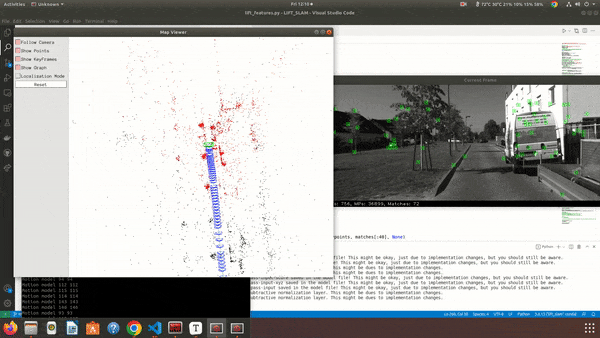

# LIFT-SLAM




LIFT SLAM is a hybrid SLAM that combines a learned feature detector and descriptor along with a classical SLAM back-end such as ORB SLAM.

## Installation

Things to apt install

```
sudo apt install libgl1-mesa-dev libglew-dev pkg-config libegl1-mesa-dev libwayland-dev libxkbcommon-dev wayland-protocols libeigen3-dev
```

### ORB-SLAM2

- #### OpenCV 3 

- #### [Pangolin](https://github.com/stevenlovegrove/Pangolin/releases/tag/v0.6)

  ```
  cd third-party/Pangolin-0.6
  mkdir build
  cd build
  cmake ..
  cmake --build .
  sudo make install
  ```

- #### Build

  ```
  cd SLAM
  chmod +x build.sh
  ./build.sh
  ```

- #### Test

  ```
  cd workspace
  ./SLAM/Examples/Monocular/mono_kitti_orb SLAM/Vocabulary/ORBvoc.txt SLAM/Examples/Monocular/KITTI04-12.yaml data/04-Straight-Line-Drive
  ```

### LIFT

- Create a separate conda env for this

- #### OpenCV 3

- Several Python Packages

  ```
  pip install -r requirements.txt
  ```

- cudatoolkit (choose one)

  ```
  conda install -c anaconda cudatoolkit=10.2
  conda install -c anaconda cudatoolkit=11.0
  ```

- Build (No need, all Python)

  ```
  
  ```
  
- Test

  ```
  python lift_features.py
  ```


## Running LIFT SLAM

- Your KITTI data should be under `data/<sequence>` from the root of this repo, e.g. `data/04-Straight-Line-Drive`

- Go to `lift_parser.py` and change the folder directory to the sequence you want and run it

  ```
  main_dir = "data/04-Straight-Line-Drive"
  ```

- Run LIFT SLAM

  ```
  cd workspace
  ./SLAM/Examples/Monocular/mono_kitti_lift SLAM/Vocabulary/ORBvoc.txt SLAM/Examples/Monocular/KITTI04-12.yaml data/04-Straight-Line-Drive
  ```

- Evaluate

  ```
  python evaluation.py
  ```
